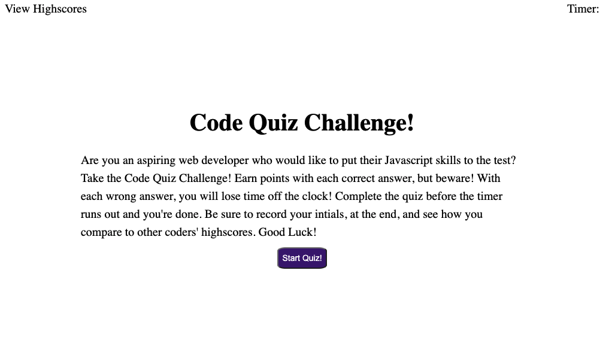

# Code_Quiz

This application was designed to provide aspiring Web Developers with a quick and fun way to test their Javascript knowledge. Users race against time, while answering a series of Javascript based questions. Correct answers result in points earned, while wrong answers will result in a time penalty. If the winner completes the quiz in the time provided, they will have the opportunity to save their results and compare with other quiz takers!

## How to Use

-Upon opening the application, the user will be greeted by the Code Quiz welcome screen.
-Once the user presses the "Start Quiz!" button, the timer begins and so does the quiz!
-When the user answers all questions -or- when the timer reaches zero...the quiz is complete!

Enjoy!
